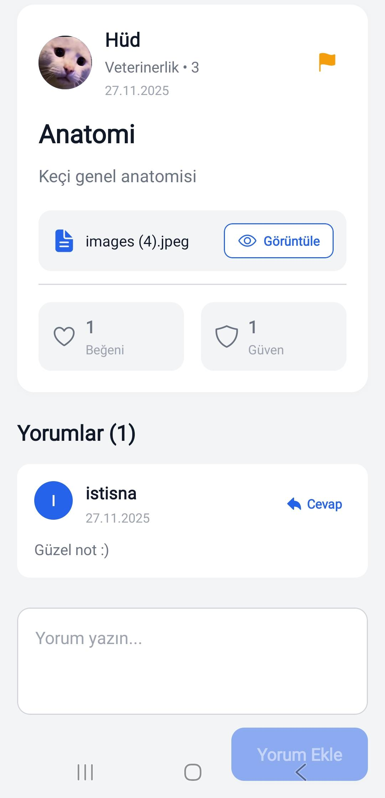
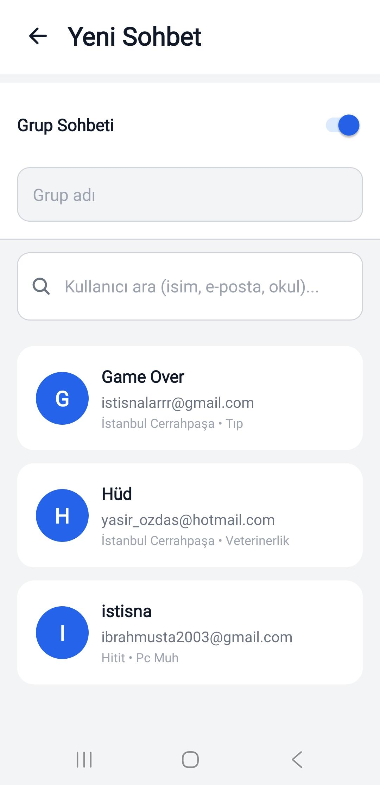
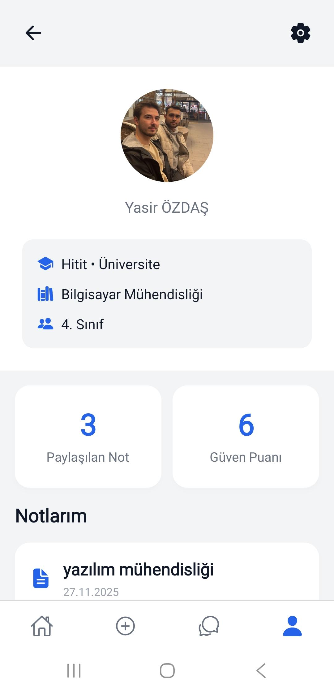

# Not-Lan

**Not-Lan**, **mobil** (Android ve iOS, [Expo](https://expo.dev/) ile) ve **web** tarayıcı üzerinden çalışacak şekilde tasarlanmış bir not paylaşım ve sohbet uygulamasıdır. Tek kod tabanı; responsive arayüz ile masaüstü web ve telefon deneyimini destekler.

## Ekran görüntüleri (mobil)

Aşağıda uygulamanın mobil arayüzünden örnekler ve her birinin neyi gösterdiği kısaca açıklanmıştır.

| | | |
|:--:|:--:|:--:|
|  |  |  |
| **Ana sayfa** — Paylaşılan notların listelendiği ekran; arama, sıralama ve kategori filtreleri ile notlara hızlı erişim. | **Not detayı** — Seçilen notun tam içeriği, dosya önizlemesi ve etkileşimler (ör. yorum / beğeni) için detay görünümü. | **Not paylaşma** — Yeni not ekleme; başlık, açıklama, ders/kategori ve dosya veya görsel yükleme alanları. |
|  |  |  |
| **Sohbetler** — Mevcut konuşmaların listesi; yeni mesaj veya sohbet başlatmaya giriş noktası. | **Sohbet** — Bir sohbet içinde mesajlaşma veya sohbet başlatma / kullanıcı arama ile ilgili ekran. | **Profil** — Kullanıcı bilgileri, güven skoru, paylaşılan notlar ve profil düzenlemeye yönlendirme. |

<p align="center">
  
</p>

<p align="center"><strong>Ayarlar</strong> — Hesap, bildirimler ve uygulama tercihleri; çıkış ve güvenlikle ilgili seçenekler.</p>

## Teknolojiler

| Alan | Kullanılanlar |
|------|----------------|
| **Çerçeve** | [Expo](https://expo.dev/) ~54, [React Native](https://reactnative.dev/) 0.81, [React](https://react.dev/) 19 |
| **Web** | [React Native Web](https://necolas.github.io/react-native-web/), [React DOM](https://react.dev/) |
| **Navigasyon** | [React Navigation](https://reactnavigation.org/) (native, stack, bottom tabs) |
| **Backend / veri** | [Firebase](https://firebase.google.com/) — Authentication, Cloud Firestore, Cloud Storage |
| **Diğer** | [react-native-gesture-handler](https://docs.swmansion.com/react-native-gesture-handler/), [react-native-screens](https://github.com/software-mansion/react-native-screens), [Async Storage](https://react-native-async-storage.github.io/async-storage/), Expo modülleri (bildirimler, dosya / medya seçici, vb.) |

## Minimum sistem gereksinimleri

Geliştirme ortamı için önerilen alt sınırlar:

| Bileşen | Gereksinim |
|---------|------------|
| **İşletim sistemi** | Windows 10/11, macOS veya Linux (web + Metro için) |
| **Node.js** | **20.x LTS** veya üzeri (18.x ile de çalışabilir; resmi olarak LTS sürüm önerilir) |
| **Paket yöneticisi** | npm (projede `package-lock.json` ile uyumlu) |
| **RAM** | En az **8 GB** (Android emülatörü için 16 GB daha rahat) |
| **Web geliştirme** | Güncel bir tarayıcı (Chrome, Edge, Firefox, Safari) |
| **Android cihaz / emülatör** | [Android Studio](https://developer.android.com/studio) veya fiziksel cihaz + USB hata ayıklama (Expo Go veya geliştirme derlemesi) |
| **iOS simülatör / cihaz** | **macOS** + Xcode + iOS Simulator veya fiziksel iPhone (Expo Go veya geliştirme derlemesi) |

Uygulamayı yalnızca **web** olarak çalıştıracaksanız Node.js + tarayıcı yeterlidir; Android Studio / Xcode şart değildir.

## Gereksinimler (proje)

- Yukarıdaki minimum geliştirme ortamı
- Kendi [Firebase](https://console.firebase.google.com/) projeniz

## Kurulum

```bash
git clone <repo-url>
cd Not-LAN
npm install
```

## Ortam değişkenleri (Firebase)

Çalıştırmak için:

1. `.env.example` dosyasını `.env` olarak kopyalayın.
2. [Firebase Console](https://console.firebase.google.com/) → projeniz → **Project settings** (dişli) → **Your apps** bölümünden web (veya uygun) uygulama yapılandırmasını açın.
3. Aşağıdaki alanları **kendi** değerlerinizle doldurun:

| Değişken | Açıklama |
|----------|----------|
| `EXPO_PUBLIC_FIREBASE_API_KEY` | apiKey |
| `EXPO_PUBLIC_FIREBASE_AUTH_DOMAIN` | authDomain |
| `EXPO_PUBLIC_FIREBASE_PROJECT_ID` | projectId |
| `EXPO_PUBLIC_FIREBASE_STORAGE_BUCKET` | storageBucket |
| `EXPO_PUBLIC_FIREBASE_MESSAGING_SENDER_ID` | messagingSenderId |
| `EXPO_PUBLIC_FIREBASE_APP_ID` | appId |
| `EXPO_PUBLIC_FIREBASE_MEASUREMENT_ID` | İsteğe bağlı (Analytics) |

4. Ortam değişkenlerini değiştirdikten sonra Metro’yu durdurup yeniden başlatın: `npm run start`.

> **Not:** `EXPO_PUBLIC_*` değişkenleri istemci paketine gömülür; bu Firebase web SDK yapılandırması için normaldir. **Sunucu tarafı gizli anahtarları** (service account JSON, Admin SDK vb.) bu dosyalara koymayın; mobil/web bundle içinde olmamalıdır. Güvenlik için Firestore ve Storage **kurallarını** Firebase konsolunda sıkılaştırın.

## Çalıştırma

```bash
npm run start      # Geliştirme menüsü (QR, platform seçimi)
npm run web        # Web
npm run android    # Android
npm run ios        # iOS (macOS)
```

## Lisans

Bu proje [MIT Lisansı](LICENSE) ile lisanslanmıştır.
