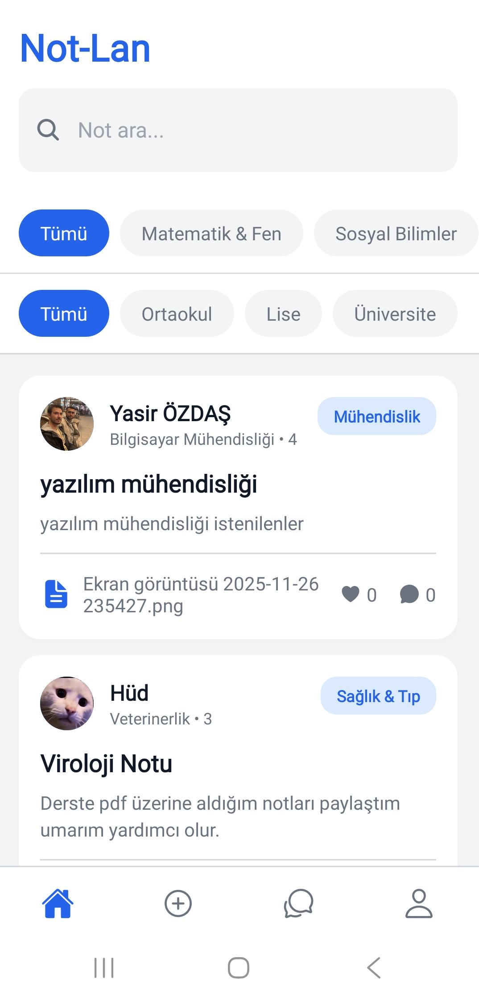
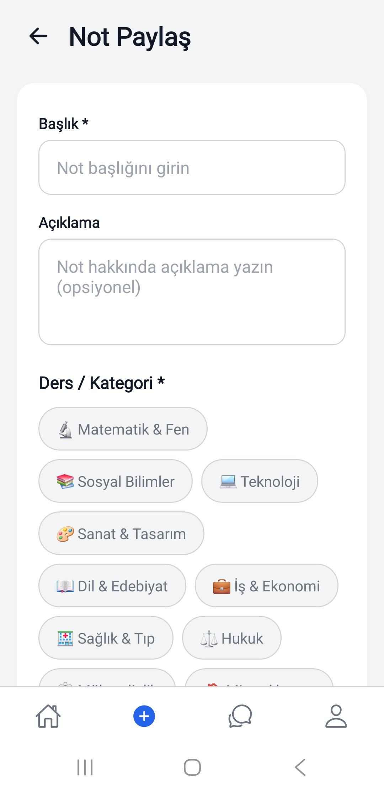
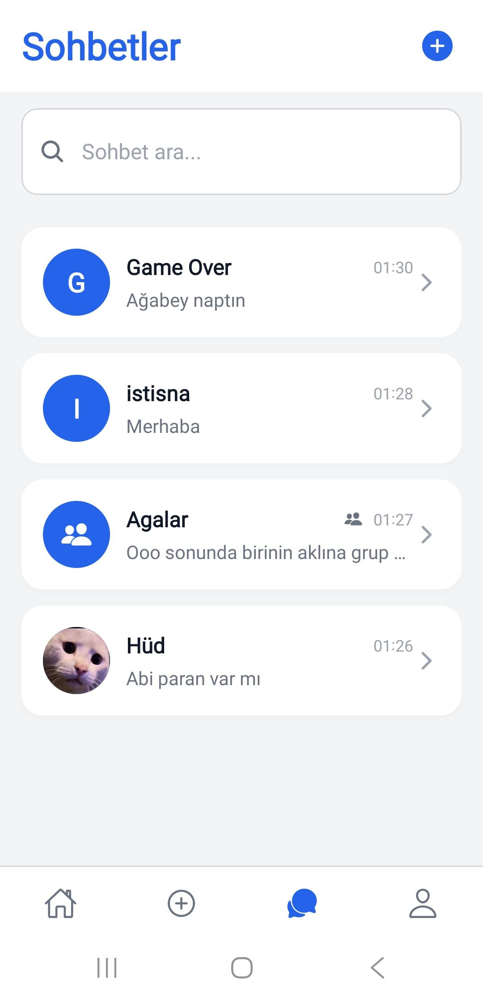
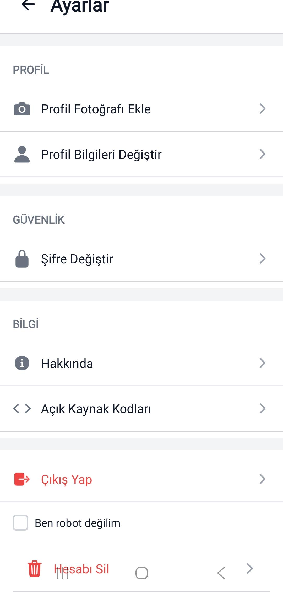

# Not-Lan (Eğitim ve Materyal Paylaşım Platformu)

**Not-Lan**, öğrenciler ve geliştiriciler için tasarlanmış açık kaynaklı bir eğitim, not paylaşım ve iletişim platformudur. [Expo](https://expo.dev/) altyapısı kullanılarak tek bir kod tabanıyla geliştirilmiş olup; responsive tasarımı sayesinde Android, iOS ve masaüstü web tarayıcılarında kesintisiz bir deneyim sunar. 

*Not: Bu proje tamamen eğitim ve yardımlaşma amaçlı geliştirilmiş bir araçtır.*

## Arayüz İncelemesi (Mobil Geliştirme Ortamı)

Aşağıda uygulamanın temel işlevlerinden birkaçını gösteren geliştirici ekran görüntüleri yer almaktadır.

| | |
|:--:|:--:|
|  |  |
| **Ana Akış** — Sisteme yüklenen ders notlarının listelendiği ana modül. Arama, kategorizasyon ve sıralama algoritmaları içerir. | **İçerik Yükleme** — Sisteme yeni materyal ekleme formu. Başlık, açıklama, ders kategorisi ve medya yükleme bileşenlerini barındırır. |
|  |  |
| **Mesajlaşma Paneli** — Kullanıcılar arası aktif iletişim oturumlarının ve geçmiş konuşmaların listelendiği ekran. | **Sistem Ayarları** — Hesap tercihleri, oturum yönetimi ve güvenlik parametreleri. |

## Teknik Altyapı ve Bağımlılıklar

Proje mimarisi aşağıdaki modern web ve mobil teknolojileri üzerine inşa edilmiştir:

| Kategori | Teknoloji Yığını |
|------|----------------|
| **Çatı (Framework)** | [Expo](https://expo.dev/) ~54, [React Native](https://reactnative.dev/) 0.81, [React](https://react.dev/) 19 |
| **Web Entegrasyonu** | [React Native Web](https://necolas.github.io/react-native-web/), [React DOM](https://react.dev/) |
| **Navigasyon** | [React Navigation](https://reactnavigation.org/) (Native, Stack, Bottom Tabs) |
| **Veri & Arka Uç** | [Firebase](https://firebase.google.com/) — Authentication, Cloud Firestore (NoSQL), Cloud Storage |
| **Yan Modüller** | `react-native-gesture-handler`, `react-native-screens`, `Async Storage`, donanım erişimi için Expo SDK modülleri. |

## Geliştirme Ortamı Gereksinimleri

Projeyi yerel makinenizde (local environment) derlemek için aşağıdaki donanım ve yazılım gereksinimleri önerilmektedir:

* **İşletim Sistemi:** Windows 10/11, macOS veya Linux
* **Node.js Çekirdeği:** **20.x LTS** sürümü tavsiye edilir (18.x ile geriye dönük uyumluluk mevcuttur).
* **Paket Yöneticisi:** `npm` (Bağımlılıklar `package-lock.json` referans alınarak kurulmalıdır).
* **Bellek (RAM):** Minimum **8 GB** (Android Emülatörü kullanılacaksa 16 GB önerilir).
* **Derleme Ortamları:**
    * *Android için:* [Android Studio](https://developer.android.com/studio) / Expo Go
    * *iOS için:* **macOS** tabanlı sistem, Xcode ve iOS Simulator / Expo Go
    * *Web için:* Modern bir tarayıcı (V8 veya WebKit tabanlı)

## Gereksinimler (proje)

- Yukarıdaki minimum geliştirme ortamı
- Kendi [Firebase](https://console.firebase.google.com/) projeniz

## Kurulum

```bash
git clone https://github.com/Hud-Alfa/Not-LAN.git
cd Not-LAN
npm install
```

## Ortam değişkenleri (Firebase)

Çalıştırmak için:

1. `.env.example` dosyasını `.env` olarak kopyalayın.
2. [Firebase Console](https://console.firebase.google.com/) → projeniz → **Project settings** (dişli) → **Your apps** bölümünden web (veya uygun) uygulama yapılandırmasını açın.
3. Aşağıdaki alanları **kendi** değerlerinizle doldurun:

| Değişken | Açıklama |
|----------|----------|
| `EXPO_PUBLIC_FIREBASE_API_KEY` | apiKey |
| `EXPO_PUBLIC_FIREBASE_AUTH_DOMAIN` | authDomain |
| `EXPO_PUBLIC_FIREBASE_PROJECT_ID` | projectId |
| `EXPO_PUBLIC_FIREBASE_STORAGE_BUCKET` | storageBucket |
| `EXPO_PUBLIC_FIREBASE_MESSAGING_SENDER_ID` | messagingSenderId |
| `EXPO_PUBLIC_FIREBASE_APP_ID` | appId |
| `EXPO_PUBLIC_FIREBASE_MEASUREMENT_ID` | İsteğe bağlı (Analytics) |

4. Ortam değişkenlerini değiştirdikten sonra Metro’yu durdurup yeniden başlatın: `npm run start`.

## Çalıştırma

```bash
npm run start      # Geliştirme menüsü (QR, platform seçimi)
npm run web        # Web
npm run android    # Android
npm run ios        # iOS (macOS)
```

## Lisans

Bu proje [MIT Lisansı](LICENSE) ile lisanslanmıştır.
